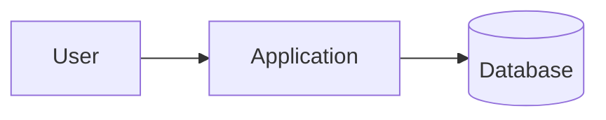

# Architecture — <PROJECT NAME>

> How the subsystems connect. Keep diagrams as text/Mermaid so they version-control well.

## System Context

_(What talks to what — components, integrations, external systems.)_

## Integrations

| From | To | Protocol | Notes |
|---|---|---|---|
| | | | |

## Data Schemas

_(Key tables / collections and their relationships.)_
