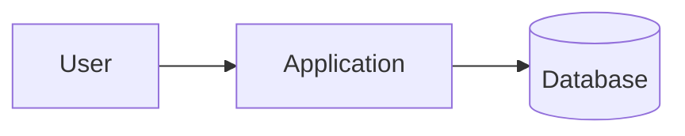

# setup — Set Up or Upgrade a WIKI-LLM Project

**This skill is the only supported way to create or upgrade a WIKI-LLM environment.** Share
this single file; a teammate drops it into a folder and tells their agent "run the
setup skill." The same file handles both first-time setup and later upgrades.

**Template version: 1.0** (see "Version History & Migrations" at the bottom).

When the user runs this skill, build or upgrade the environment in the **current working
folder**, following the mode rules below.

## Trigger phrases
- "run the setup skill"
- "set up a wiki" / "create a knowledge base" / "scaffold a WIKI-LLM project"
- "initialize a wiki here"

## What you will create
A tool-neutral, scalable knowledge base: immutable `raw/` documents → agent-maintained
`wiki/` (entities, concepts, a `solutions/` QnA layer, `source-code/`, sources) → human-curated
`docs/`, your code in `sourcecode/`, page `templates/`, operation `skills/`, helper `scripts/`,
editable `rules/`, a regenerable `index.md` + `manifest.json`, an optional codebase-memory MCP,
and an `AGENTS.md` schema (with a `CLAUDE.md` pointer) that tells any agent how to operate it.

Two ingest commands: **`ingest`** for documents (default) and **`ingest-sourcecode`** for code.

---

## Modes — this skill does both Setup and Upgrade

First decide which mode applies to the target folder:

- **Fresh Setup** — the folder has no `AGENTS.md` and no `wiki/`. Run **Procedure A**.
- **Upgrade** — the folder already has `AGENTS.md` or `wiki/`. Run **Procedure B**.
  Never overwrite the user's content; only add what's missing and apply migrations.

**Reading a project's current version** (for Upgrade):
- Open `docs/solution-profile.md` and read `template_version` from its frontmatter (or the
  "WIKI template version" line in Section 1).
- If that field is **missing** (or there is no `solution-profile.md`), the project is
  **pre-version** — treat its current version as `pre-1.0` and run the pre-version → 1.0
  migration in "Version History & Migrations".

Every run — setup or upgrade — is a **deployment**: stamp the version into
`docs/solution-profile.md` and log it.

---

## Step 0 — Announce & confirm (REQUIRED for both modes)

Before creating, changing, or deleting anything, tell the user what is about to happen and
**wait for explicit accept or cancel**. Do not proceed without a clear "yes".

- **Fresh Setup** — say:
  > "This folder has no WIKI-LLM project. I'll do a **NEW SETUP** at template **v1.0**.
  >  Proceed? (yes / cancel)"
- **Upgrade** — say (fill in the detected current version; "pre-version" if none found):
  > "I found an existing WIKI-LLM project at **<current version>**. I'll **UPGRADE** it to
  >  template **v1.0**. I'll first back up your whole folder to `backup/backup-<datetime>.zip`,
  >  then add only what's missing (your content is never overwritten). Proceed? (yes / cancel)"

If the user cancels, stop and make **no** changes. If they accept, continue to the matching
procedure below.

---

## Procedure A — Fresh Setup (empty folder)

1. **Ask for the project name** (one question only). Always create the full environment,
   including the code folders (`sourcecode/`, `wiki/source-code/`, `wiki/source-code-output/`)
   and the MCP configs — they sit ready even if the user has no code yet.
2. **Create the directories** in "Directory structure" below.
3. **Create every file** in "File contents" below. Each file is delimited by
   `===== FILE: <path> =====` and `===== END FILE =====`; write the exact content between
   the markers (not the markers themselves).
   > **IMPORTANT — write files directly.** Use your normal file-writing tool to create each
   > file, copying the content between its markers verbatim. The markers are just visual
   > boundaries. **Do NOT** parse this skill with shell text tools (`awk`, `sed`, `perl`,
   > `csplit`, here-docs) — those break across OSes (e.g. BSD vs GNU `awk`). Just write each
   > file one by one.
4. **Substitute placeholders:** replace every `<PROJECT NAME>` with the project name, every
   `YYYY-MM-DD` with today's date.
5. **Check & install prerequisites** per `tools/prerequisites.md`: verify Python and Node.js,
   install the document-extraction add-ons (docx/pdf/pptx/xlsx), and **install the
   `codebase-memory-mcp` engine** (prebuilt installer, or build the `-pro` fork) — ask before
   downloading/compiling; if declined or unavailable, `ingest-sourcecode` still works via the
   static fallback. Update `tools/prerequisites-checklist.md` Status and log the result.
6. **Validate the tree against the File manifest.** List the files you created and compare to
   the manifest (exactly the listed files, plus the `.gitkeep` dirs). Then:
   - **Missing** a manifest file → create it.
   - **Extra / bad-path** file not in the manifest (e.g. a stray from a marker mismatch) →
     delete it. Sanity-check: every top-level item should be one of `raw/ wiki/ docs/
     sourcecode/ templates/ tools/ rules/ skills/ scripts/ AGENTS.md README.md PROMPTS.md
     CLAUDE.md .mcp.json .vscode/ .gitignore`. Anything else is a mistake — remove it.
   - **Never delete** `.git/` or `setup.md`.
7. **Stamp the version:** in `docs/solution-profile.md`, set `template_version` and the
   Section 1 version line to the current template version (1.0), and put today's date in the
   Version History row.
8. **Confirm:** list what was created, show the 5-step quick start from the README, and
   append to `wiki/log.md`: `## [YYYY-MM-DD] deploy | fresh setup at template v1.0`.

> **If you must re-run** (a failed first attempt): delete only generated artifacts and keep
> `.git/` and `setup.md`. Then redo from step 2.

---

## Procedure B — Upgrade an existing project

> Only run this after the user accepted in Step 0.

1. **Back up first — before touching anything.** Create a `backup/` folder, then zip the
   **entire project folder** into `backup/backup-<datetime>.zip`, where `<datetime>` is
   `YYYYMMDD-HHmmss` (e.g. `backup/backup-20260627-143022.zip`). **Exclude the `backup/`
   folder itself** from the archive (so it never zips its own backups), and you may also
   exclude `.git/`. Confirm the saved backup path to the user before making any changes. If
   the backup cannot be created, **stop** — do not proceed with the upgrade.
   - Example (any one works): `zip -r backup/backup-$(date +%Y%m%d-%H%M%S).zip . -x './backup/*' './.git/*'`
     or PowerShell `Compress-Archive -Path * -DestinationPath "backup/backup-$(Get-Date -Format yyyyMMdd-HHmmss).zip"`.
2. **Determine the current version** (see "Reading a project's current version" above).
3. **Apply migrations** from "Version History & Migrations" in order, from the project's
   current version up to this skill's template version (1.0). Migrations only **add** missing
   files, folders, and fields — they NEVER delete or overwrite existing user content
   (`raw/`, wiki pages, `sourcecode/`, docs you've written). This includes the rename to the
   1.0 layout, adding `rules/`/`skills/`/`scripts/`, and re-checking prerequisites.
   > When creating any missing file, take its content from "File contents" using the **strict
   > marker rule** and the **File manifest** above — write directly with your file tool; do NOT
   > extract with `awk`/`sed`/`perl`/`csplit`/here-docs, and ignore marker-looking text in
   > prose/backticks/blockquotes. A file is valid only if its path is in the manifest.
4. **Validate against the File manifest.** Every manifest path should now exist (created here
   or already present). If the migration produced any **extra / bad-path** file not in the
   manifest (e.g. from a marker mismatch), **delete only that stray file**. Never delete
   `.git/`, `setup.md`, or the user's own content (`raw/`, wiki pages, `sourcecode/`, `docs/`).
5. **Re-stamp the version:** in `docs/solution-profile.md`, update `template_version` and the
   Section 1 version line to the new version, and **prepend** a row to the Version History
   table: `| <today> | <new version> | <what changed> |`.
6. **Log it:** append to `wiki/log.md`: `## [YYYY-MM-DD] deploy | upgraded <old> → <new> (backup: backup/backup-<datetime>.zip)`.
7. **Reindex** so `index.md`/`manifest.json` reflect existing pages.
8. **Report** to the user: the backup path, exactly what was added, and the new version.

---

## Directory structure

```
raw/                 (with subfolders: requirements/  specs/  meetings/  web/  assets/)
wiki/                (subfolders: entities/ concepts/ solutions/ source-code/ source-code-output/ sources/)
docs/                (with subfolder: subsystems/)
sourcecode/          (your source code — always created, even if empty for now)
templates/
tools/
rules/
skills/
scripts/
```

Add a `.gitkeep` to `raw/requirements`, `raw/specs`, `raw/meetings`, `raw/web`, and
`docs/subsystems` so empty folders are tracked. Also create `.mcp.json`, `.vscode/mcp.json`,
and `CLAUDE.md` (all in "File contents").

(Upgrade mode also creates a `backup/` folder for pre-change archives — it is git-ignored
and not part of a fresh setup.)

---

## File manifest — create EXACTLY these 48 files

These are the only files to create (plus the empty `.gitkeep` dirs in Directory structure).
If your extraction yields any path **not** in this list (e.g. from instructional text), it is a
false match — discard it. After writing, the created file set must equal this list exactly.

```
AGENTS.md
README.md
PROMPTS.md
CLAUDE.md
.gitignore
.mcp.json
.vscode/mcp.json
wiki/index.md
wiki/manifest.json
wiki/log.md
wiki/overview.md
wiki/entities/README.md
wiki/concepts/README.md
wiki/solutions/README.md
wiki/source-code/README.md
wiki/source-code/code-map.md
wiki/source-code/ingest-ledger.md
wiki/source-code-output/README.md
wiki/sources/README.md
wiki/sources/ingest-ledger.md
raw/README.md
docs/README.md
docs/solution-profile.md
docs/solution-map.md
docs/architecture.md
docs/glossary.md
sourcecode/README.md
templates/README.md
templates/entity.template.md
templates/concept.template.md
templates/solution.template.md
templates/code-module.template.md
templates/source-summary.template.md
templates/code-graph.template.html
tools/regenerate-index.md
tools/prerequisites.md
tools/prerequisites-checklist.md
scripts/convert.py
rules/README.md
rules/01-ingest-source-location.md
rules/02-ingest-folder-dedup.md
rules/03-post-ingest-summary.md
rules/04-cite-sources.md
rules/05-no-training-knowledge.md
skills/README.md
skills/ingest-document.md
skills/ingest-sourcecode.md
skills/reset-sourcecode.md
```

---

## File contents

> **How to read this section (strict):** a real file block is a line that **begins at column 0**
> with `===== FILE: <path> =====`, then the file's content, ending at a line that is exactly
> `===== END FILE =====`. **Ignore** any marker-looking text that is indented, inside backticks,
> inside a blockquote (`>`), or anywhere in prose — those are examples, not files. Only the paths
> in the **File manifest** above are valid.
> **Write each file directly with your file-writing tool** (copy content verbatim). Do **not**
> extract with `awk`/`sed`/`perl`/`csplit` or here-docs — they are not portable and they
> mis-match instructional text. Go one file at a time.

===== FILE: AGENTS.md =====
# AGENTS.md — WIKI-LLM Schema & Instructions

> Master instruction schema for any AI agent (Claude Code, VS Code, Cursor, Cowork, etc.).
> **Do not delete.** Tool-neutral; tool-specific add-ons in §10. `CLAUDE.md` points here.

## 0. Rules, Skills, Prerequisites & MCP (read first)
- **Rules**: load and obey every file in `rules/` (raw-only ingest, checksum dedup,
  post-ingest summary, cite sources, no training-knowledge gap-filling). Editable.
- **Skills**: follow the playbooks in `skills/` — `ingest` (documents, default),
  `ingest-sourcecode` (code).
- **Prerequisites**: first-time setup runs `tools/prerequisites.md` (Python, Node.js,
  docx/pdf/pptx/xlsx add-ons via `scripts/convert.py`, **and installs the codebase-memory MCP**;
  upgrade re-checks and installs it if missing).
- **MCP**: if a `codebase-memory` MCP is configured (`.mcp.json` / `.vscode/mcp.json`) use it
  to analyze code faster; else read files directly (fallback). See §10.

### Command routing
| Command | Accepts | Playbook |
|---|---|---|
| `ingest <file \| folder \| URL>` (default) | docs (.md .txt .pdf .pptx .docx .xlsx .html), a folder, or a http(s):// URL (saved to raw/web/) | skills/ingest-document.md |
| `ingest-sourcecode <file/folder>` | code (.cs .js .ts .py .java .cpp .c .go .rs .sql ...) | skills/ingest-sourcecode.md |

Documents are the default and priority; code is opt-in.

## 1. Project Context
**Project**: <PROJECT NAME>. Living knowledge base built by an AI agent from raw documents and
source code. The template version is recorded in `docs/solution-profile.md`; created/upgraded
only via the `setup` skill.

## 2. Folder Layout
- `raw/` — immutable documents (requirements/ specs/ meetings/ assets/). Never edit.
- `wiki/` — agent-maintained: `index.md` + `manifest.json` (regenerated), `log.md` (activity),
  `overview.md`, `entities/`, `concepts/`, `solutions/` (QnA), `source-code/` (code docs),
  `source-code-output/` (generated mermaid/json/html reports), `sources/`.
- `docs/` — curated: solution-profile, solution-map, architecture, glossary, subsystems/.
- `sourcecode/` — your code. `templates/` — page templates. `tools/` — specs. `scripts/` —
  convert.py. `rules/` — rules. `skills/` — playbooks.

### 2.0 Logs & records (don't mix)
- `wiki/log.md` — activity log (human timeline of operations).
- `wiki/sources/ingest-ledger.md` / `wiki/source-code/ingest-ledger.md` — per-file SHA-256 +
  timestamp; tell the agent what to skip (unchanged) vs (re)process (new/changed).

### 2.1 Scaling
Past ~15 pages per category, group by domain subfolder. Navigate by domain -> tags -> search.

## 3. Page Conventions
lowercase-hyphen names; frontmatter (title, category, domain, tags, sources/source_files,
last_updated, last_verified for solution/code, status); relative links; end with
`## Related Pages` + `## Sources`; start from `templates/`.

## 4. Operations
- **ingest** (documents): obey rules/; raw-only; checksum-dedup vs sources ledger; convert via
  `scripts/convert.py`; write source summary + update overview/entities/concepts; flag
  contradictions; update ledger; reindex; log; summarize. (skills/ingest-document.md)
- **ingest-sourcecode**: checksum-dedup vs code ledger; analyze via codebase-memory MCP else
  read directly; write a wiki/source-code page + reports in wiki/source-code-output/
  (.graph.json/.mmd/.html/.graph.db.zst); update code-map + ledger; reindex; log; summarize.
  (skills/ingest-sourcecode.md)
- **reset-sourcecode**: clear all code docs/reports/ledger/graph for a new project; documents
  untouched. (skills/reset-sourcecode.md)
- **query**: read manifest/index; answer with cited links (Rule 04); by default file a
  solution card; reindex; log.
- **solution**: capture problem -> context -> cause -> fix -> verify in wiki/solutions/.
- **lint**: contradictions, orphans, stale, code drift (checksum vs ledger), missing pages,
  broken links, index/manifest mismatch.
- **reindex**: rebuild index.md + manifest.json from frontmatter (tools/regenerate-index.md).
- **supersede**: add new versions; mark old `status: superseded`.

## 5. Behaviour Rules
Never edit `raw/`. Always obey `rules/` (incl. cite sources, no training-knowledge). Never
invent catalog entries. Regenerate the index after page changes; append to `wiki/log.md`.
Prefer updating over duplicating. Flag uncertainty. Synthesize, don't dump. Never commit
secrets (no credentials/keys/PII in raw/, sourcecode/, or wiki).

## 6. Supported Inputs
`.md`/`.txt` directly; `.docx`/`.pdf`/`.pptx`/`.xlsx`/`.html` via `scripts/convert.py` once
prerequisites are installed. Documents ingest from `raw/` only (Rule 01).

## 7. Domains Registry (optional)
List active domains here for naming consistency.

## 8. Updating This Schema
Any team member may edit; the agent follows the latest committed version.

## 9. Quick Command Reference
`ingest raw/<file/folder>` - `ingest-sourcecode sourcecode/<path>` - `reset-sourcecode` -
`answer: <question>` - `save that as a solution` - `lint the wiki` - `reindex`.

## 10. Optional: Tool-Specific Add-ons
**codebase-memory MCP** (optional, recommended for code; install per tools/prerequisites-checklist.md).
It's a **stdio command**: Claude Code -> `.mcp.json`
(`{ "mcpServers": { "codebase-memory": { "command": "codebase-memory-mcp", "args": [] } } }`);
VS Code -> `.vscode/mcp.json` (`{ "servers": { "codebase-memory": { "command": "codebase-memory-mcp", "args": [] } } }`).
Static fallback when absent. `CLAUDE.md` points Claude Code here. It stores a SQLite graph at
`~/.cache/codebase-memory-mcp/<project>.db` (copied compressed to
`wiki/source-code-output/<module>.graph.db.zst`). Inspect with `index_repository`,
`get_architecture`, `search_graph`, `trace_path` (who calls what), `query_graph`,
`get_code_snippet`, `detect_changes`.
===== END FILE =====

===== FILE: README.md =====
# WIKI-LLM — A Living Knowledge Base

> Drop in documents and code. An AI agent builds and maintains a structured wiki you can
> question — and every answer is kept for next time.

Tool-neutral (Claude Code, VS Code, Cursor, ...). Documents are the default; code is opt-in.

## Quick start
1. Set the project name in `AGENTS.md` §1 and `docs/solution-profile.md`.
2. Put a document in a `raw/` subfolder (`requirements/`, `specs/`, `meetings/`).
3. `ingest raw/requirements/your-file.md` (a file or a whole folder).
4. Ask questions — answers cite wiki pages and can be saved as solution cards.
5. Code: put it in `sourcecode/`, then `ingest-sourcecode sourcecode/your-module.cs`.

## Folder guide
- `raw/` (you) immutable documents - `wiki/` (agent) knowledge incl. `solutions/` (QnA) +
  `source-code/` - `docs/` (you) background - `sourcecode/` (you) code - `templates/` -
  `tools/` - `scripts/` (convert.py) - `rules/` (you) - `skills/` playbooks - `AGENTS.md`
  schema (`CLAUDE.md` points to it) - `PROMPTS.md` prompts.

## Two ingest commands
`ingest` = documents (default). `ingest-sourcecode` = code. Both skip unchanged files via
SHA-256 checksums in the per-area ingest ledgers, so re-runs are cheap.

## Prerequisites, rules & MCP
Setup checks Python + Node.js and installs docx/pdf/pptx/xlsx add-ons (`tools/prerequisites.md`).
Rules in `rules/` (editable): raw-only ingest, checksum dedup, post-ingest summary, cite
sources, no training-knowledge. Optional `codebase-memory` MCP (`.mcp.json` /
`.vscode/mcp.json`) speeds code analysis; static fallback otherwise.

## How it scales
Domain subfolders past ~15 pages/category, tags, a regenerable `index.md` + `manifest.json`,
and the `solutions/` layer so answers compound.

## Keeping it fresh
Run `lint the wiki` weekly/per-sprint — it flags only drifted pages (code whose checksum
changed, broken links, contradictions, orphans).
===== END FILE =====

===== FILE: PROMPTS.md =====
# PROMPTS.md — Ready-to-Use Prompt Library
> Copy-paste into your agent. Tool-neutral.

## Ingest documents (file, folder, or URL; only new/changed processed)
- `ingest raw/requirements/project-brief.md`
- `ingest raw/meetings/`
- `ingest https://example.com/some-article`  (fetched + saved to raw/web/ first)
- `re-ingest raw/meetings/2026-06-08.md`

## Ingest source code (put code in sourcecode/; codebase-memory MCP used if configured)
- `ingest-sourcecode sourcecode/services/order-service.cs`
- `ingest-sourcecode sourcecode/services/`
  (outputs: wiki/source-code/<m>.md + wiki/source-code-output/<m>.{mmd,graph.json,html,graph.db.zst};
   the .html is an interactive animated graph — labels, flowing edges, auto-tour, click to inspect)
- "Using the MCP, trace_path for <function> inbound — list every caller."
- `reset-sourcecode`  (clear all code knowledge for a new project; documents untouched)

## Query (answers cite wiki pages, not training knowledge)
- "Explain the <process> end-to-end from the wiki."
- "What are all the user roles and what can each do?"
- "What unresolved questions are noted in the wiki?"

## Solutions (QnA)
- "Save that answer as a solution card; tag it and link related pages."
- "Has anyone solved anything about <topic>? Check wiki/solutions."

## Lint & reindex
- `lint the wiki`  (contradictions, orphans, drift, broken links)
- `reindex`  (rebuild index.md + manifest.json)

## Setup & upgrade
- "Run the setup skill. Project name: <PROJECT NAME>."
- "Run the setup skill to upgrade this project (back up first, confirm, tell me the version)."
===== END FILE =====

===== FILE: CLAUDE.md =====
# CLAUDE.md

> Pointer file for Claude Code (and the Claude Code VS Code extension), which auto-reads
> `CLAUDE.md`. The real, tool-neutral schema lives in **[`AGENTS.md`](AGENTS.md)** — read it
> first and follow it.

**Read [`AGENTS.md`](AGENTS.md) at the start of every session and obey it**, including:

- the rules in [`rules/`](rules/README.md) (ingest only from `raw/`, checksum dedup,
  post-ingest summary, cite sources, no training-knowledge gap-filling);
- the operation playbooks in [`skills/`](skills/README.md)
  (`ingest` for documents, `ingest-sourcecode` for code);
- the optional **codebase-memory MCP** (see `.mcp.json` / `.vscode/mcp.json`) for fast code
  analysis, with a static fallback when it is not configured.

Do not duplicate the schema here — `AGENTS.md` is the single source of truth.
===== END FILE =====

===== FILE: .gitignore =====
# --- Secrets & credentials (never commit) ---
.env
.env.*
*.key
*.pem
*.pfx
*secret*
*credential*
*.token
# --- Dependencies / build ---
node_modules/
dist/
build/
__pycache__/
*.pyc
.venv/
venv/
# --- OS / editor noise ---
.DS_Store
Thumbs.db
.idea/
*.swp
# --- VS Code: ignore local settings but DO share the MCP config ---
.vscode/*
!.vscode/mcp.json
# --- Local AI-tool config (per-machine, per-tool — keep out of the shared template) ---
.claude/
.cursor/
.github/copilot-instructions.md
# (Note: .mcp.json is intentionally committed so the codebase-memory MCP is shareable.)
# --- Upgrade backups (created by setup; never commit) ---
backup/
# --- Local-only generated output (optional: remove if you want to track exports) ---
# output/
===== END FILE =====

===== FILE: .mcp.json =====
{
  "mcpServers": {
    "codebase-memory": {
      "command": "codebase-memory-mcp",
      "args": []
    }
  }
}
===== END FILE =====

===== FILE: .vscode/mcp.json =====
{
  "servers": {
    "codebase-memory": {
      "command": "codebase-memory-mcp",
      "args": []
    }
  }
}
===== END FILE =====

===== FILE: wiki/index.md =====
---
title: Wiki Index
category: index
last_updated: YYYY-MM-DD
---

# Wiki Index — <PROJECT NAME>

> Master catalog of every wiki page. Read this first when looking for information.
> This file is **regenerable**: it is rebuilt from each page's frontmatter, so it never
> has to be edited by hand. Ask your agent to "rebuild the index" after any batch of changes.
> The machine-readable twin of this file is [`manifest.json`](manifest.json).

This wiki is empty. Ingest your first document (see the project `README.md`) and the
agent will populate the sections below.

---

## How this index scales

Pages are grouped by **category** (entity / concept / solution / source) and, within a
category, by **domain** subfolder once a category grows past ~15 pages. A domain is a
business area such as `ordering`, `inventory`, `billing`, `auth`. Domains are created on
demand — you never have to predefine them. For hundreds of pages, navigate by domain
first, then by tag.

- **New to the project?** → Start with [Project Overview](overview.md)
- **Looking for a business rule or process?** → `concepts/`
- **Looking for a solved problem / past answer?** → `solutions/`
- **Looking for a role, actor, or data object?** → `entities/`
- **Looking for what a source document said?** → `sources/`
- **Looking by topic across everything?** → search the `tags:` field, or grep the wiki

---

## Overview

_(none yet)_

## Entities — WHO and WHAT

_(none yet — grouped by domain once populated)_

## Concepts — HOW (business rules & processes)

_(none yet — grouped by domain once populated)_

## Solutions — Solved problems & past answers (QnA)

_(none yet — see [`solutions/README.md`](solutions/README.md))_

## Source Summaries

_(none yet — one page per ingested raw source)_
===== END FILE =====

===== FILE: wiki/manifest.json =====
{
  "project": "<PROJECT NAME>",
  "schema_version": 1,
  "generated": "YYYY-MM-DD",
  "page_count": 0,
  "domains": [],
  "pages": []
}
===== END FILE =====

===== FILE: wiki/log.md =====
# Wiki Activity Log

> **This is the activity log** — the human-readable timeline of every operation, for debugging
> and history. It is NOT the dedup record: per-file checksums live in the *ingest ledgers*
> (`wiki/sources/ingest-ledger.md`, `wiki/source-code/ingest-ledger.md`).
>
> Append-only. Do not edit past entries.
> Format: `## [YYYY-MM-DD HH:MM] <operation> | <description>`
> Operations: `ingest`, `ingest-sourcecode`, `query`, `solution`, `lint`, `reindex`, `setup`, `deploy`.

---

## [YYYY-MM-DD] deploy | Fresh setup at template v1.0.
===== END FILE =====

===== FILE: wiki/overview.md =====
---
title: Project Overview
category: overview
tags: [overview]
sources: []
last_updated: YYYY-MM-DD
---

# Project Overview — <PROJECT NAME>

> One-paragraph executive summary of the whole project. The agent keeps this current
> as documents are ingested.

## Purpose

_(What problem does this project solve? Who is it for?)_

## Scope

_(In scope / out of scope.)_

## Key Stakeholders & Roles

_(Filled in as entities are discovered.)_

## Status & Timeline

_(Phases, milestones, current state.)_

## Related Pages

- [Wiki Index](index.md)
===== END FILE =====

===== FILE: wiki/entities/README.md =====
# Entities — WHO and WHAT

Pages describing the actors, roles, systems, and data objects in the project
(e.g. `customer.md`, `order.md`, `user-roles.md`).

- One page per entity, named after the noun.
- Use [`templates/entity.template.md`](../../templates/entity.template.md).
- Once this folder passes ~15 pages, group by domain subfolder: `entities/billing/invoice.md`.
- Tag every page and cross-link related concepts, solutions, and code pages.
===== END FILE =====

===== FILE: wiki/concepts/README.md =====
# Concepts — HOW (Business Rules & Processes)

Pages describing workflows, business rules, state machines, and processes
(e.g. `order-lifecycle.md`, `replenishment-workflow.md`).

- One page per process/rule, named after it.
- Use [`templates/concept.template.md`](../../templates/concept.template.md).
- Once this folder passes ~15 pages, group by domain subfolder: `concepts/inventory/reservation-rules.md`.
- Tag every page and cross-link related entities, solutions, and code pages.
===== END FILE =====

===== FILE: wiki/solutions/README.md =====
# Solutions — Solved Problems & Past Answers (QnA Knowledge Base)

This folder is the **compounding QnA layer**. Whenever a question is answered, a problem
is debugged, or a decision resolves something non-obvious, the agent files a **solution
card** here so the knowledge is reusable forever instead of being re-derived each time.

This is the part of the wiki people come back to most. Treat filing a solution as the
**default** after any substantive question — not an afterthought.

## Conventions

- One card per file, named after the problem: `stock-oversell-on-concurrent-orders.md`
- Group into domain subfolders once this grows past ~15 cards: `solutions/ordering/...`
- Every card uses [`templates/solution.template.md`](../../templates/solution.template.md)
- Every card has `tags:` so it is findable by topic, and links to related concept/entity/code pages
- Cards have a `last_verified` date; the lint pass flags cards older than their related sources/code

## What belongs here

- "How do we handle X?" answers worth keeping
- Bug → root cause → fix write-ups
- Decisions and their rationale ("why we chose Y over Z")
- Workarounds and gotchas

## What does NOT belong here

- Raw source text (that goes in `raw/`)
- Definitions of an actor or data object (that is an `entities/` page)
- A general process description (that is a `concepts/` page)
===== END FILE =====

===== FILE: wiki/source-code/README.md =====
# Source-Code — Documentation of Source Modules

One page per code module/service, describing what it does in plain language and linking it to
the business knowledge it implements. The code lives in `sourcecode/`; this folder describes it.

- Created by `ingest-sourcecode` (see [`skills/ingest-sourcecode.md`](../../skills/ingest-sourcecode.md)).
- Use [`templates/code-module.template.md`](../../templates/code-module.template.md).
- Group by domain subfolder once this passes ~15 pages: `source-code/ordering/order-service.md`.
- Each page lists `source_files:` and a `last_verified:` date (drift rule — see `sourcecode/README.md`).
- `code-map.md` indexes all code pages and maps them to subsystems.
- `ingest-ledger.md` records every processed file with its checksum + timestamp (for dedup).
===== END FILE =====

===== FILE: wiki/source-code/code-map.md =====
---
title: Code Map
category: code
tags: [code, architecture]
source_files: []
last_updated: YYYY-MM-DD
last_verified: YYYY-MM-DD
---

# Code Map — <PROJECT NAME>

> Index of all documented code modules and the business concepts they implement.
> Regenerated alongside the wiki index.

| Module page | Language | Source file(s) | Subsystem / Domain | Implements (concepts/entities) | Last verified |
|---|---|---|---|---|---|
| _(none yet)_ | | | | | |
===== END FILE =====

===== FILE: wiki/source-code/ingest-ledger.md =====
# Source-Code Ingest Ledger

> **Purpose:** record every source file processed by `ingest-sourcecode`, with its checksum
> and timestamp, so re-runs only (re)process **new or changed** files and skip unchanged ones.
> This saves tokens — dumping a few new files never forces a full re-scan.
>
> This is **not** the activity log. For the operation timeline see [`../log.md`](../log.md).
>
> **How it works:** the agent computes each file's SHA-256. If the file is absent here → new
> (process it). If present but the checksum differs → changed (re-process, update the row).
> If present and the checksum matches → skip.

| File | SHA-256 (short) | Last processed | Status |

| File | SHA-256 (short) | Last processed | Status |
|------|-----------------|----------------|--------|
| _(none yet)_ | | | |
===== END FILE =====

===== FILE: wiki/source-code-output/README.md =====
# Source-Code Output — Generated Reports

Generated **report artifacts** for documented code modules. Kept separate from the analysis
pages in `wiki/source-code/` on purpose: those are the curated docs; these are machine-generated
visual/data reports you can regenerate any time.

`ingest-sourcecode` writes one set per module (named after the module):

| File | What it is |
|---|---|
| `<module>.graph.json` | Nodes + call edges from the codebase-memory MCP (machine-readable). |
| `<module>.mmd` | Mermaid call/dependency diagram (renders in GitHub / VS Code / md preview). |
| `<module>.html` | **Interactive animated graph** (vis-network) — the default. Labels, role colors brightened by connection count, edge thickness + flowing particles by relationship strength, a hands-free auto-tour (Pause/Play), and click-a-node to see callers/callees. Self-contained (data embedded); needs internet on first open (loads vis-network from CDN). |
| `<module>.graph.db.zst` | Zstd-compressed copy of the MCP's SQLite **knowledge graph** — the full reference you can re-query offline. |

## The `.db` snapshot and how to query it

`<module>.graph.db.zst` is a compressed copy of the SQLite graph the
`codebase-memory-mcp` engine built (its live copy lives in `~/.cache/codebase-memory-mcp/`).
Keep it here as the portable source of truth — decompress with `zstd -d <file>` and the MCP (or
any SQLite tool) can read it. After an `ingest-sourcecode` run you can ask the agent to query it
with these MCP functions:

| MCP function | Purpose — what you can check |
|---|---|
| `get_architecture` | Big picture: languages, packages, entry points, hotspots, clusters. |
| `search_graph` | Find symbols by name/label/file (e.g. all functions matching `.*Handler.*`). |
| `trace_path` | **Who calls a function / what it calls** — the calling chain (inbound/outbound). |
| `query_graph` | Cypher-like queries over nodes/edges (e.g. count callers per function). |
| `get_code_snippet` | Read the source of a symbol by its qualified name. |
| `detect_changes` | Map a git diff to impacted symbols + blast radius. |

These are derived from the MCP's knowledge graph (or the static fallback) — safe to delete and
regenerate. The human-readable summary for each module lives in `wiki/source-code/<module>.md`.
===== END FILE =====

===== FILE: wiki/sources/README.md =====
# Source Summaries

One summary page per ingested raw document. The filename mirrors the raw file:
`raw/requirements/project-brief.md` → `sources/project-brief-summary.md`.

- Use [`templates/source-summary.template.md`](../../templates/source-summary.template.md).
- Each summary links back to its immutable raw source and lists which wiki pages it touched.
- This folder is the audit trail of "what each document told us."
===== END FILE =====

===== FILE: wiki/sources/ingest-ledger.md =====
# Document Ingest Ledger

> **Purpose:** record every document processed by `ingest`, with its checksum and timestamp,
> so re-running on a folder only (re)processes **new or changed** files and skips unchanged ones.
>
> This is **not** the activity log. For the operation timeline see [`../log.md`](../log.md).
>
> **How it works:** same as the source-code ledger — match the file's SHA-256: absent → new,
> different → changed (re-process), same → skip.

| File | SHA-256 (short) | Last processed | Status |
|------|-----------------|----------------|--------|
| _(none yet)_ | | | |
===== END FILE =====

===== FILE: raw/README.md =====
# raw/ — Immutable Source Documents

Drop your source material here. **Never edit a file once it is added** — these are the
ground truth the wiki is derived from. If a document changes, add a new version
(e.g. `user-stories-v2.md`) and let the agent mark the old one superseded.

## Subfolders

- `requirements/` — briefs, user stories, scope docs
- `specs/` — functional and technical specifications
- `meetings/` — meeting notes, transcripts, decision logs
- `web/` — content fetched from URLs (the agent saves the page text here on `ingest <url>`)

Add more subfolders as needed (e.g. `emails/`, `support-tickets/`, `vendor-docs/`).

## Supported formats

`.md` and `.txt` ingest directly. For `.docx`, `.pdf`, `.pptx`, ask your agent to extract
the text first (most modern agents can read these directly, or you can export to text).

## Do not commit secrets

Never put credentials, API keys, tokens, or personal data (PII) in `raw/`. See the
project `.gitignore` and the secrets rule in `AGENTS.md`.
===== END FILE =====

===== FILE: docs/README.md =====
# docs/ — Human-Curated Solution Background

You maintain these files (the agent helps, but you own them). They hold the durable,
high-level picture of the solution that does not change with every ingest.

- `solution-profile.md` — project purpose, business context, tech stack, key contacts
- `solution-map.md` — master inventory of every program / module / service / subsystem
- `architecture.md` — how subsystems connect: diagrams, integrations, data schemas
- `glossary.md` — single source of truth for business and technical terms
- `subsystems/` — one detailed doc per subsystem (business rules, data model, integrations)

When you update a `docs/` file, ask your agent to ingest it so the wiki stays in sync.
===== END FILE =====

===== FILE: docs/solution-profile.md =====
---
title: Solution Profile
category: docs
template_version: "1.0"
last_updated: YYYY-MM-DD
---

# Solution Profile — <PROJECT NAME>

> The durable, high-level background of the solution. **This file also records the version.**
> Update it when scope, technology, or key contacts change, then ingest it.

## 1. Project Context

- **Project name**: <PROJECT NAME>
- **WIKI template version**: 1.0
- **Purpose**: _(one paragraph)_
- **Business owner / sponsor**: _()_

## 2. Scope

- **In scope**: _()_
- **Out of scope**: _()_

## 3. Technology Stack

_(languages, frameworks, databases, hosting, key third-party services)_

## 4. Key Contacts

| Name | Role | Area |
|---|---|---|
| | | |

## 5. Delivery Phases

_(Phase 1 / 2 / 3 and what each contains)_

## 6. Version History

> One row per deployment of the WIKI-LLM environment (newest first). The `setup` skill
> appends a row each time it sets up or upgrades this project. "pre-version" means a project
> created before version control existed (upgraded to 1.0 on next run).

| Date | Template Version | Notes |
|---|---|---|
| YYYY-MM-DD | 1.0 | Initial version-controlled deployment |
===== END FILE =====

===== FILE: docs/solution-map.md =====
---
title: Solution Map
category: docs
last_updated: YYYY-MM-DD
---

# Solution Map — <PROJECT NAME>

> Master inventory of every program, module, and service. This is the spine that keeps
> a large solution navigable. Each row links to its subsystem doc and/or code page.
> Designed to scale to hundreds of entries — keep it sorted by subsystem, then ID.

## Subsystems

| # | Subsystem | Doc | Owner | Phase | Status |
|---|---|---|---|---|---|
| 01 | _(name)_ | [docs/subsystems/01-...md](subsystems/) | | | |

## Programs / Modules / Services

| ID | Name | Subsystem | Type (service/ui/job) | Phase | Status | Doc / Code |
|---|---|---|---|---|---|---|
| | | | | | | |
===== END FILE =====

===== FILE: docs/architecture.md =====
---
title: Architecture
category: docs
last_updated: YYYY-MM-DD
---

# Architecture — <PROJECT NAME>

> How the subsystems connect. Keep diagrams as text/Mermaid so they version-control well.

## System Context

_(What talks to what — components, integrations, external systems.)_



## Integrations

| From | To | Protocol | Notes |
|---|---|---|---|
| | | | |

## Data Schemas

_(Key tables / collections and their relationships.)_
===== END FILE =====

===== FILE: docs/glossary.md =====
---
title: Glossary
category: docs
last_updated: YYYY-MM-DD
---

# Glossary — <PROJECT NAME>

> Single source of truth for business and technical terms. Keep definitions short.
> When the agent finds a new term during ingest, it adds it here and cross-links it.

| Term | Definition | Related Pages |
|---|---|---|
| _(none yet)_ | | |
===== END FILE =====

===== FILE: sourcecode/README.md =====
# sourcecode/ — Your Source Code (optional)

**Put your source code — C#, JavaScript, SQL, anything — here in `sourcecode/`**, in whatever
structure your project already uses. No need to reorganize by feature or language; mirroring
your existing repo is fine, and mixed file types in one folder are fine.

The code lives in `sourcecode/`; the **documentation** of that code lives in
`wiki/source-code/` so it is searchable and cross-linked with the business knowledge.

## How code is documented

1. You add or change code in `sourcecode/`.
2. Ask your agent: `ingest-sourcecode sourcecode/<path>` (a file or a whole folder).
3. The agent analyzes it — using the **codebase-memory MCP** if configured, otherwise by
   reading the file directly — and creates/updates a page in `wiki/source-code/` describing
   purpose, classes, functions, dependencies, and relationships, linked to the concepts it
   implements.

> Index by the unit a person asks about (a service/module/feature), not one page per file.
> For **SQL**: schema (tables/relationships) → `docs/architecture.md` + entity pages;
> stored procedures / views / logic → code pages here.

## Only new or changed files are processed (token saving)

Every processed file is recorded in `wiki/source-code/ingest-ledger.md` with its **SHA-256
checksum** and **timestamp**. On the next `ingest-sourcecode` run the agent skips files whose
checksum is unchanged and only (re)processes new or modified ones — so dumping a few new
files never forces a full re-scan. (This is separate from `wiki/log.md`, the activity log.)

## Secrets

Never commit credentials, keys, tokens, `.env` files, or PII. See the project `.gitignore`.

> Don't want code in this project? Delete this `sourcecode/` folder and `wiki/source-code/`.
===== END FILE =====

===== FILE: templates/README.md =====
# templates/ — Page Templates

Blank templates the agent (and humans) use so every wiki page is consistent. Copy the
matching template, fill it in, and place the result in the right `wiki/` folder.

| Template | Use for | Goes in |
|---|---|---|
| `entity.template.md` | An actor, role, system, or data object | `wiki/entities/` |
| `concept.template.md` | A business rule, workflow, or process | `wiki/concepts/` |
| `solution.template.md` | A solved problem / reusable answer (QnA) | `wiki/solutions/` |
| `code-module.template.md` | Documentation of a code module | `wiki/source-code/` |
| `source-summary.template.md` | A summary of one ingested raw document | `wiki/sources/` |
| `code-graph.template.html` | Interactive force-directed code graph (filled by ingest-sourcecode) | `wiki/source-code-output/` |

Every page carries frontmatter (`title`, `category`, `domain`, `tags`, `sources`,
`last_updated`, `status`) so the index and `manifest.json` can be regenerated from it.
===== END FILE =====

===== FILE: templates/entity.template.md =====
---
title: <Entity Name>
category: entity
domain: <domain, e.g. ordering>
tags: [<tag1>, <tag2>]
sources: [raw/<path>/<file>.md]
last_updated: YYYY-MM-DD
status: active
---

# <Entity Name>

> One-sentence summary of who/what this is.

## Overview

<2–4 paragraph synthesis: what this actor/object is, why it matters.>

## Key Details

- Attributes / fields
- Relationships to other entities
- Business rules that apply

## Open Questions

- <unresolved item or contradiction, with the source>

## Related Pages

- [<Related concept>](../concepts/<file>.md)
- [<Related entity>](<file>.md)

## Sources

- [<Raw source>](../../raw/<path>/<file>.md) — <what it contributed>, ingested YYYY-MM-DD
===== END FILE =====

===== FILE: templates/concept.template.md =====
---
title: <Concept / Process Name>
category: concept
domain: <domain, e.g. inventory>
tags: [<tag1>, <tag2>]
sources: [raw/<path>/<file>.md]
last_updated: YYYY-MM-DD
status: active
---

# <Concept / Process Name>

> One-sentence summary of this rule or process.

## Overview

<2–4 paragraph synthesis of how it works.>

## Key Details

<Steps, state machine, rules, tables, or diagram as appropriate.>

## Who Can Do What

| Action | Permitted Roles |
|---|---|
| | |

## Open Questions

- <unresolved item or contradiction, with the source>

## Related Pages

- [<Related entity>](../entities/<file>.md)
- [<Related concept>](<file>.md)

## Sources

- [<Raw source>](../../raw/<path>/<file>.md) — <section/ID>, ingested YYYY-MM-DD
===== END FILE =====

===== FILE: templates/solution.template.md =====
---
title: <Problem in plain words>
category: solution
domain: <domain, e.g. ordering>
tags: [<tag1>, <tag2>]
sources: [<raw file, wiki page, code file, or conversation>]
last_updated: YYYY-MM-DD
last_verified: YYYY-MM-DD
status: active
---

# <Problem in plain words>

> One-sentence summary of the problem and its resolution.

## Problem / Symptom

<What was asked or what went wrong, in concrete terms.>

## Context

<When does this apply? Which modules, roles, or conditions trigger it?>

## Root Cause

<Why it happens. Omit if this is a "how do we do X" answer rather than a bug.>

## Solution

<The answer or fix, as clear steps.>

1. ...
2. ...

## Verification

<How we confirmed it works — test, check, observed result.>

## Related Pages

- [<Related concept>](../concepts/<file>.md)
- [<Related code module>](../code/<file>.md)

## Sources

- <where this came from — raw doc, meeting, code, or the question that prompted it>
===== END FILE =====

===== FILE: templates/code-module.template.md =====
---
title: <Module / Service Name>
category: code
domain: <domain, e.g. ordering>
language: <python|javascript|typescript|csharp|sql|...>
tags: [<tag1>, <tag2>]
source_files: [sourcecode/<path>/<file>]
implements: [<concept or entity pages this code realizes>]
last_updated: YYYY-MM-DD
last_verified: YYYY-MM-DD
status: active
---

# <Module / Service Name>

> One-sentence summary of what this code does.

## Purpose

<What problem this module solves and where it fits.>

## Classes

| Class | Responsibility |
|---|---|
| | |

## Functions

| Function / Method | Signature | Purpose |
|---|---|---|
| | | |

## Dependencies

- Internal: <other modules>
- External: <libraries, services, DB tables>

## Relationships

- Calls: <what this module calls>
- Called by: <what depends on this module>

## Business Concepts Implemented

- [<Concept>](../concepts/<file>.md)
- [<Entity>](../entities/<file>.md)

## Open Questions / Gotchas

- <anything non-obvious; link to a solution card if one exists>

## Related Pages

- [Code Map](code-map.md)

## Sources

- `sourcecode/<path>/<file>` — analyzer: <mcp|static>, verified YYYY-MM-DD
===== END FILE =====

===== FILE: templates/source-summary.template.md =====
---
title: <Source name> Summary
category: source
tags: [<tag1>, <tag2>]
sources: [raw/<path>/<file>.md]
last_updated: YYYY-MM-DD
status: active
---

# <Source name> Summary

> One-sentence description of what this source document is.

## Key Takeaways

- <main point 1>
- <main point 2>

## Quotes / Notable Excerpts

> "<verbatim excerpt worth keeping, with where it came from>"

## Decisions / Action Items

<If a meeting or decision log.>

## Wiki Pages Touched by This Source

- [<page>](../entities/<file>.md) — created / updated
- [<page>](../concepts/<file>.md) — created / updated

## Open Questions Raised

- <anything unresolved this source introduced>

## Sources

- [<Raw source>](../../raw/<path>/<file>.md) — ingested YYYY-MM-DD
===== END FILE =====

===== FILE: templates/code-graph.template.html =====
<!DOCTYPE html>
<!-- Interactive code-graph report. ingest-sourcecode fills {{MODULE}} and {{GRAPH_JSON}}
     ({{GRAPH_JSON}} = contents of <module>.graph.json, embedded so the file is self-contained).
     vis-network (CDN) · labels · role colors brightened by connections · line width+particles by
     strength · animated flowing particles · hands-free auto-tour · click a node to inspect. -->
<html lang="en"><head><meta charset="utf-8"><meta name="viewport" content="width=device-width,initial-scale=1">
<title>{{MODULE}} — code graph</title>
<script src="https://cdnjs.cloudflare.com/ajax/libs/vis-network/9.1.9/dist/vis-network.min.js"></script>
<style>
*{box-sizing:border-box} html,body{margin:0;height:100%;background:#070a16;color:#e2e8f0;font-family:-apple-system,Segoe UI,Roboto,sans-serif;overflow:hidden}
#hdr{position:fixed;top:0;left:0;right:0;padding:12px 18px;z-index:5;background:linear-gradient(#070a16ee,#070a1600);pointer-events:none}
#hdr h1{margin:0;font-size:17px} #hdr .m{font-size:12px;opacity:.7}
#net{position:fixed;inset:0}
#info{position:fixed;right:16px;top:64px;width:230px;background:#0b1020e6;border:1px solid #1e293b;border-radius:10px;padding:14px;font-size:13px;z-index:5}
#info .k{opacity:.6} #info b{color:#fff} ul{margin:6px 0;padding-left:18px} li{margin:1px 0}
#ctl{position:fixed;left:16px;top:62px;z-index:6} #ctl button{background:#0b1020e6;color:#e2e8f0;border:1px solid #334155;border-radius:8px;padding:7px 12px;font-size:13px;cursor:pointer}
.legend{position:fixed;left:16px;bottom:14px;font-size:11px;z-index:5;opacity:.85;line-height:1.7}
.dot{display:inline-block;width:10px;height:10px;border-radius:50%;margin-right:5px;vertical-align:middle}
</style></head>
<body>
<div id="hdr"><h1>{{MODULE}} — interactive code graph</h1>
<div class="m">auto-presenting · drag · scroll to zoom · click a node (pauses)</div></div>
<div id="ctl"><button id="toggle">⏸ Pause</button></div>
<div id="net"></div>
<div id="info">Auto-tour running — each node glides to center in turn. Click any node to inspect.</div>
<div class="legend">
<span class="dot" style="background:#1e90ff"></span>root
<span class="dot" style="background:#5b7cff"></span>view
<span class="dot" style="background:#ff2d6b"></span>data hub
<span class="dot" style="background:#19e3a5"></span>shared
<span class="dot" style="background:#ffb020"></span>card/util
<span class="dot" style="background:#9aa7bd"></span>helper
<br>size & brightness = connections · line thickness & particle count = relationship strength</div>
<script>
var DATA={{GRAPH_JSON}};
var BASE={root:[30,144,255],view:[91,124,255],hub:[255,45,107],shared:[25,227,165],util:[255,176,32],helper:[154,167,189]};
var deg={}; DATA.calls.forEach(function(e){deg[e.from]=(deg[e.from]||0)+1;deg[e.to]=(deg[e.to]||0)+1;});
var maxd=Math.max.apply(null,Object.values(deg).concat([1]));
var maxStr=Math.max.apply(null,DATA.calls.map(function(c){return deg[c.to]||0;}).concat([1]));
function L(a,b,t){return Math.round(a+(b-a)*t);}
function rgb(role,d){var c=BASE[role]||BASE.view,t=0.12+0.6*(d/maxd);return 'rgb('+L(c[0],255,t)+','+L(c[1],255,t)+','+L(c[2],255,t)+')';}
var fileOf={},roleOf={}; DATA.nodes.forEach(function(n){fileOf[n.id]=n.file;roleOf[n.id]=n.role||'view';});
function nb(id,w){return DATA.calls.filter(function(e){return e[w]===id;}).map(function(e){return w==='target'?e.source:e.target;});}

var nodes=new vis.DataSet(DATA.nodes.map(function(n){var d=deg[n.id]||0;return {
  id:n.id,label:n.id,value:d+2,color:{background:rgb(n.role||'view',d),border:rgb(n.role||'view',d)},
  font:{color:'#e6ecf7',size:15,strokeWidth:3,strokeColor:'#070a16'}};}));
var rawEdges=DATA.calls.map(function(e,i){return {id:i,from:e.from,to:e.to,str:(deg[e.to]||0)};});
var edges=new vis.DataSet(rawEdges.map(function(e){return {id:e.id,from:e.from,to:e.to,
  width:0.5+3*(e.str/maxStr),color:{color:'rgba(120,150,255,0.25)',highlight:'#ff5a96'},smooth:{type:'continuous'}};}));

var net=new vis.Network(document.getElementById('net'),{nodes:nodes,edges:edges},{
 nodes:{shape:'dot',scaling:{min:10,max:40}},
 edges:{arrows:{to:{enabled:true,scaleFactor:0.5}}},
 physics:{barnesHut:{gravitationalConstant:-7000,springLength:130,damping:0.25},stabilization:{iterations:200}},
 interaction:{hover:true}});

// flowing particles along edges (custom canvas animation)
net.on('afterDrawing',function(ctx){
 var pos=net.getPositions(), now=performance.now()/1000;
 rawEdges.forEach(function(e){
  var a=pos[e.from],b=pos[e.to]; if(!a||!b)return;
  var hot=(focus&&(e.from===focus||e.to===focus));
  var n=1+Math.round(3*(e.str/maxStr))+(hot?2:0);
  for(var i=0;i<n;i++){
   var f=((now*0.22)+(i/n)+e.id*0.13)%1;
   var x=a.x+(b.x-a.x)*f, y=a.y+(b.y-a.y)*f;
   ctx.beginPath();ctx.arc(x,y,hot?3:2,0,6.283);
   ctx.fillStyle=hot?'rgba(255,120,170,0.95)':'rgba(150,185,255,0.85)';ctx.fill();
  }
 });
});
function loop(){net.redraw();requestAnimationFrame(loop);} requestAnimationFrame(loop);

var focus=null;
function highlight(id){
 focus=id;
 nodes.update(DATA.nodes.map(function(n){var d=deg[n.id]||0,on=(n.id===id);
   return {id:n.id,color:{background:on?'#ffffff':rgb(n.role||'view',d),border:on?'#ffffff':rgb(n.role||'view',d)},
           borderWidth:on?3:1};}));
 var info=document.getElementById('info'),cb=nb(id,'target'),ce=nb(id,'source');
 info.innerHTML='<b style="font-size:15px">'+id+'</b><br><span class="k">'+(fileOf[id]||'')+'</span>'+
  '<p>Called by ('+cb.length+'):<ul>'+(cb.map(function(c){return '<li>'+c+'</li>';}).join('')||'<li class=k>—</li>')+'</ul></p>'+
  '<p>Calls ('+ce.length+'):<ul>'+(ce.map(function(c){return '<li>'+c+'</li>';}).join('')||'<li class=k>—</li>')+'</ul></p>';
 net.selectNodes([id]);
 net.focus(id,{scale:1.25,animation:{duration:1200,easingFunction:'easeInOutCubic'}});
}
var order=DATA.nodes.slice().sort(function(a,b){return (deg[b.id]||0)-(deg[a.id]||0);});
var idx=0,playing=true,timer=null;
function step(){highlight(order[idx%order.length].id);idx++;}
function play(){playing=true;document.getElementById('toggle').textContent='⏸ Pause';clearInterval(timer);step();timer=setInterval(step,3600);}
function pause(){playing=false;document.getElementById('toggle').textContent='▶ Play';clearInterval(timer);}
document.getElementById('toggle').onclick=function(){playing?pause():play();};
net.on('click',function(p){if(p.nodes.length){pause();highlight(p.nodes[0]);}});
net.once('stabilizationIterationsDone',function(){net.fit({animation:true});setTimeout(play,700);});
</script></body></html>
===== END FILE =====

===== FILE: tools/regenerate-index.md =====
# Tool Spec: Regenerate the Index & Manifest

> This is a **specification the agent follows** — not a script tied to any one language
> or OS. Ask your agent: "rebuild the wiki index" or "reindex".

## Goal

Rebuild `wiki/index.md` (human catalog) and `wiki/manifest.json` (machine catalog) from
the frontmatter of every wiki page, so the catalog is always accurate and never
hand-maintained. This is what keeps the wiki navigable at hundreds of pages.

## Steps

1. **Scan** every `*.md` under `wiki/` (skip `README.md` files, `index.md`, `log.md`).
2. **Read frontmatter** from each: `title`, `category`, `tags`, `sources`, `domain`
   (infer `domain` from the subfolder if not set), `last_updated`, `last_verified`,
   `status` (default `active`).
3. **Build `manifest.json`** with: `project`, `generated` (today), `page_count`,
   `domains` (sorted unique list), and a `pages` array of one object per page:
   `{ path, title, category, domain, tags, sources, last_updated, last_verified, status }`.
   Skip pages with `status: superseded` from default listings but keep them in the array.
4. **Build `index.md`** grouped by category, then by domain subfolder within each category.
   For categories with more than ~15 pages, render a per-domain subheading.
5. **Append to `log.md`**: `## [YYYY-MM-DD] reindex | rebuilt index.md + manifest.json (N pages)`.

## Notes

- Keep `index.md` human-friendly (tables, navigation hints). Keep `manifest.json` strict JSON.
- Never invent pages. The catalog reflects only files that exist on disk.
===== END FILE =====

===== FILE: tools/prerequisites.md =====
# Tool Spec: Prerequisite Check & Install (first-time setup)

> A specification the agent follows during **fresh setup**, and re-checks on **upgrade**.
> The commands are OS-specific but the steps are the same everywhere. Run only after the
> user has accepted in the skill's Step 0.
>
> **The full, traceable component list lives in
> [`prerequisites-checklist.md`](prerequisites-checklist.md)** — update its Status column as
> you check/install. This file describes *how* to run the check; that file is the inventory.

## Goal

Make sure the machine can run the wiki and **ingest rich documents (Word / PDF / PowerPoint /
Excel) with no further install prompts later**. Doing this once at setup means the user can
ingest those file types anytime without being asked to approve an installation.

## 1. Runtime checks

- **Python ≥ 3.9** — check `python3 --version` (or `python --version`). If missing or older,
  tell the user how to install the latest:
  - macOS: `brew install python` · Windows: `winget install Python.Python.3` ·
    Debian/Ubuntu: `sudo apt install python3 python3-pip` · or download from python.org.
- **Node.js (LTS)** — check `node --version`. If missing:
  - macOS: `brew install node` · Windows: `winget install OpenJS.NodeJS.LTS` ·
    Debian/Ubuntu: `sudo apt install nodejs npm` · or download from nodejs.org.

## 2. Document-extraction add-ons (Python)

Install these so `.docx`, `.pdf`, `.pptx`, `.xlsx` can be ingested directly:

- `python-docx` (Word), `python-pptx` (PowerPoint), `pdfplumber` + `pypdf` (PDF),
  `openpyxl` (Excel).

Install command (add `--break-system-packages` if pip refuses on a managed system):

```
pip install python-docx python-pptx pdfplumber pypdf openpyxl
```

Verify import succeeds for each before reporting success. These power
[`scripts/convert.py`](../scripts/convert.py), which `ingest` uses to turn `.docx`/`.pdf`/
`.pptx`/`.xlsx`/`.html` into Markdown.

## 3. Code-intelligence MCP (install at setup; re-check on upgrade)

**Install the `codebase-memory-mcp` engine as part of setup** (and on upgrade, check it and
install if missing) so `ingest-sourcecode` gets full analysis out of the box.

1. **Check:** `codebase-memory-mcp --version`. If it responds, it's installed — done.
2. **If missing, install** (ask the user before downloading/compiling):
   - **Prebuilt (fastest, no compiler):**
     `curl -fsSL https://raw.githubusercontent.com/DeusData/codebase-memory-mcp/main/install.sh | bash`
     (Windows: the `install.ps1` from the same repo.)
   - **Build the `-pro` fork (more features; needs C/C++ toolchain + zlib + make):**
     `git clone https://github.com/win4r/codebase-memory-mcp-pro.git && cd codebase-memory-mcp-pro && ./scripts/build.sh`
     → copy `build/c/codebase-memory-mcp` onto your PATH. See `prerequisites-checklist.md` rows 10–14.
3. **Confirm wiring:** the binary name must match the `codebase-memory` command in
   `.mcp.json` / `.vscode/mcp.json`.

Graceful fallback: if the user declines or has no install rights, `ingest-sourcecode` still
works via static analysis (just slower / less precise). Record which path was taken.

## 4. Record the result

- Append to `wiki/log.md`:
  `## [YYYY-MM-DD] setup | prerequisites OK (python <ver>, node <ver>, extraction add-ons, MCP: yes/no)`.
- Update the **Status** column in `prerequisites-checklist.md` for each component.
- Note any item the user must install manually.

## Notes

If the user is on a locked-down machine without install rights, ingest still works for
`.md` / `.txt`; rich formats then need either these add-ons or the text pasted into a
`.txt` under `raw/`.
===== END FILE =====

===== FILE: tools/prerequisites-checklist.md =====
# Prerequisites Checklist — traceable component list

> Single, growing inventory of everything this environment may need. The setup skill and
> `tools/prerequisites.md` use this list; the agent fills in the **Status** column when it
> checks/installs (date + ok/missing). Edit freely — add a row when a new dependency appears.

## Core (always needed)

| # | Component | Purpose | Required | Check | Install | Status |
|---|-----------|---------|----------|-------|---------|--------|
| 1 | Python ≥ 3.9 | run scripts + extraction | yes | `python3 --version` | brew/apt/winget/python.org | _unchecked_ |
| 2 | pip | install Python add-ons | yes | `pip --version` | bundled with Python | _unchecked_ |
| 3 | git | clone repos, version history | yes | `git --version` | brew/apt/winget | _unchecked_ |

## Document extraction (for ingesting .docx/.pdf/.pptx/.xlsx)

| # | Component | Purpose | Required | Check | Install | Status |
|---|-----------|---------|----------|-------|---------|--------|
| 4 | python-docx | Word → text | for .docx | `python3 -c "import docx"` | `pip install python-docx` | _unchecked_ |
| 5 | python-pptx | PowerPoint → text | for .pptx | `python3 -c "import pptx"` | `pip install python-pptx` | _unchecked_ |
| 6 | pdfplumber | PDF → text | for .pdf | `python3 -c "import pdfplumber"` | `pip install pdfplumber` | _unchecked_ |
| 7 | pypdf | PDF fallback | for .pdf | `python3 -c "import pypdf"` | `pip install pypdf` | _unchecked_ |
| 8 | openpyxl | Excel → text | for .xlsx | `python3 -c "import openpyxl"` | `pip install openpyxl` | _unchecked_ |

## Code intelligence MCP (installed at setup; re-checked on upgrade)

> Powers `ingest-sourcecode`. **Setup installs it; upgrade re-checks and installs if missing.**
> Without it the skill falls back to static analysis. Easiest path: the **upstream prebuilt**
> binary (no compiler). Power path: **build the `-pro` fork from source** (extra `explore`
> tool + fixes) — needs the toolchain below.

| # | Component | Purpose | Required | Check | Install | Status |
|---|-----------|---------|----------|-------|---------|--------|
| 9  | Node.js (LTS) | JS tooling / some agents | recommended | `node --version` | brew/apt/winget/nodejs.org | _unchecked_ |
| 10 | codebase-memory-mcp | code knowledge-graph MCP | **at setup** (re-check on upgrade) | `codebase-memory-mcp --version` | prebuilt: `curl -fsSL https://raw.githubusercontent.com/DeusData/codebase-memory-mcp/main/install.sh \| bash` (or build the -pro fork) | _unchecked_ |
| 11 | C compiler (gcc/clang) | build the `-pro` fork | optional* | `gcc --version` | macOS `xcode-select --install` · `apt install build-essential` | _unchecked_ |
| 12 | C++ compiler (g++/clang++) | build the `-pro` fork | optional* | `g++ --version` | same as above | _unchecked_ |
| 13 | make | build the `-pro` fork | optional* | `make --version` | build-essential | _unchecked_ |
| 14 | zlib dev headers | build the `-pro` fork | optional* | `ls /usr/include/zlib.h` | `apt install zlib1g-dev` (macOS: bundled) | _unchecked_ |
| 15 | zstd | graph artifact compression | optional | `zstd --version` | brew/apt/winget | _unchecked_ |

\* Only needed if you **build** the MCP fork from source. The prebuilt binary (row 10) needs none of 11–14.

## How to build the codebase-memory MCP fork (optional)

```bash
git clone https://github.com/win4r/codebase-memory-mcp-pro.git
cd codebase-memory-mcp-pro && ./scripts/build.sh        # → build/c/codebase-memory-mcp (a few min: 158 grammars)
cp build/c/codebase-memory-mcp ~/.local/bin/            # put on PATH
```
Then it matches the `codebase-memory` command in `.mcp.json` / `.vscode/mcp.json`.
===== END FILE =====

===== FILE: scripts/convert.py =====
#!/usr/bin/env python3
"""
convert.py — extract text from a document into Markdown for ingestion.

Usage:
    python scripts/convert.py raw/path/to/file.docx
    python scripts/convert.py raw/path/to/file.pdf  --out raw/path/to/file.md

Supports: .docx .pptx .xlsx .pdf .html .htm  (and passes through .md/.txt).
Needs the add-ons from tools/prerequisites.md:
    pip install python-docx python-pptx pdfplumber pypdf openpyxl
Prints the Markdown to stdout, and also writes a .md next to the source unless --no-write.
"""
import sys
import os
import argparse


def convert_docx(path):
    import docx  # python-docx
    d = docx.Document(path)
    return "\n\n".join(p.text for p in d.paragraphs if p.text.strip())


def convert_pptx(path):
    from pptx import Presentation
    out = []
    for i, slide in enumerate(Presentation(path).slides, 1):
        out.append(f"## Slide {i}")
        for shape in slide.shapes:
            if shape.has_text_frame and shape.text_frame.text.strip():
                out.append(shape.text_frame.text)
    return "\n\n".join(out)


def convert_xlsx(path):
    from openpyxl import load_workbook
    wb = load_workbook(path, data_only=True)
    out = []
    for ws in wb.worksheets:
        out.append(f"## Sheet: {ws.title}")
        for row in ws.iter_rows(values_only=True):
            cells = [("" if c is None else str(c)) for c in row]
            if any(cells):
                out.append("| " + " | ".join(cells) + " |")
    return "\n".join(out)


def convert_pdf(path):
    try:
        import pdfplumber
        with pdfplumber.open(path) as pdf:
            return "\n\n".join((pg.extract_text() or "") for pg in pdf.pages)
    except Exception:
        from pypdf import PdfReader
        return "\n\n".join((pg.extract_text() or "") for pg in PdfReader(path).pages)


def convert_html(path):
    import re
    with open(path, encoding="utf-8", errors="ignore") as f:
        html = f.read()
    text = re.sub(r"(?is)<(script|style).*?>.*?</\1>", "", html)
    text = re.sub(r"(?s)<[^>]+>", " ", text)
    return re.sub(r"[ \t]+\n", "\n", text).strip()


CONVERTERS = {
    ".docx": convert_docx, ".pptx": convert_pptx, ".xlsx": convert_xlsx,
    ".pdf": convert_pdf, ".html": convert_html, ".htm": convert_html,
}


def main():
    ap = argparse.ArgumentParser()
    ap.add_argument("path")
    ap.add_argument("--out")
    ap.add_argument("--no-write", action="store_true")
    args = ap.parse_args()

    ext = os.path.splitext(args.path)[1].lower()
    if ext in (".md", ".txt"):
        with open(args.path, encoding="utf-8", errors="ignore") as f:
            md = f.read()
    elif ext in CONVERTERS:
        try:
            md = CONVERTERS[ext](args.path)
        except ImportError as e:
            sys.exit(f"Missing add-on for {ext}: {e}. See tools/prerequisites.md.")
    else:
        sys.exit(f"Unsupported type: {ext}")

    if not args.no_write:
        out = args.out or os.path.splitext(args.path)[0] + ".md"
        with open(out, "w", encoding="utf-8") as f:
            f.write(md)
        print(f"# wrote {out}", file=sys.stderr)
    print(md)


if __name__ == "__main__":
    main()
===== END FILE =====

===== FILE: rules/README.md =====
# rules/ — Project Rules (authoritative & editable)

These files define hard rules the agent must follow when operating this wiki. They are
loaded via [`AGENTS.md`](../AGENTS.md). **You may edit any rule** to fit your team — the
agent obeys the latest committed version. Keep each rule short and unambiguous.

| Rule | Summary |
|---|---|
| [01-ingest-source-location.md](01-ingest-source-location.md) | Documents ingest only from `raw/`. |
| [02-ingest-folder-dedup.md](02-ingest-folder-dedup.md) | Folder ingest; checksum dedup (process only new/changed files). |
| [03-post-ingest-summary.md](03-post-ingest-summary.md) | After ingest, report processed vs skipped. |
| [04-cite-sources.md](04-cite-sources.md) | Cite the wiki page behind every claim. |
| [05-no-training-knowledge.md](05-no-training-knowledge.md) | Answer from the wiki, not training knowledge; say so if missing. |

To add a rule, create a new `NN-name.md` here, keep it short, and add a row above.
To relax a rule, edit its file. To disable one, delete its file (or note it as inactive).
===== END FILE =====

===== FILE: rules/01-ingest-source-location.md =====
# Rule 01 — Ingest sources must live under `raw/`

**Rule:** The agent may only ingest files located under the `raw/` folder, in the
appropriate subfolder — e.g. meeting notes in `raw/meetings/`, requirements in
`raw/requirements/`, specs in `raw/specs/`.

**URLs are allowed** as an ingest input: when given a `http(s)://` URL, the agent first
**fetches the page and saves it to `raw/web/<slug>.md`** (recording the source URL), then
ingests that file. So the rule still holds — every ingested source ends up under `raw/`.

**If asked to ingest a file outside `raw/`:** do NOT ingest it. Reject politely and tell the
user to place the file in the correct `raw/` subfolder first, for example:

> "I can only ingest files from `raw/`. Please move this file into the right subfolder —
>  meeting notes → `raw/meetings/`, requirements → `raw/requirements/`,
>  specs → `raw/specs/` — then run ingest again."

**Why:** `raw/` is the immutable source-of-truth. Keeping every source there guarantees
provenance, lets the de-duplication log (Rule 02) work, and keeps the wiki auditable.

**Exception:** `docs/` files are human-curated background and may be ingested directly
(see `PROMPTS.md` → "docs/ in sync"). Edit this rule if your team needs other exceptions.
===== END FILE =====

===== FILE: rules/02-ingest-folder-dedup.md =====
# Rule 02 — Folder-level ingest with checksum de-duplication

**Rule:** `ingest` (documents) and `ingest-sourcecode` (code) both accept either a single file
**or a folder**, and both only process files that are new or changed.

When given a folder (e.g. `ingest raw/meetings/` or `ingest-sourcecode sourcecode/services/`):

1. **List** all relevant files recursively (documents: `.md`/`.txt` and, with the extraction
   add-ons, `.docx`/`.pdf`/`.pptx`/`.xlsx`; code: source extensions like `.cs`/`.js`/`.ts`/
   `.py`/`.sql`/...).
2. **Compare against the ledger** — compute each file's **SHA-256** and check the matching
   ledger:
   - documents → `wiki/sources/ingest-ledger.md`
   - source code → `wiki/source-code/ingest-ledger.md`

   Absent from the ledger → **new** (process). Checksum differs → **changed** (re-process).
   Checksum matches → **skip** (no tokens spent re-reading it).
3. **Process only new/changed files.**
4. **Update the ledger** row for each processed file (path, short SHA-256, timestamp, status),
   and add an `ingest` / `ingest-sourcecode` entry to `wiki/log.md`.

This makes ingest **idempotent and cheap**: re-running on a folder only handles what actually
changed. To force a re-process, the user can say so explicitly (e.g. "re-ingest <file>").
===== END FILE =====

===== FILE: rules/03-post-ingest-summary.md =====
# Rule 03 — Post-ingest summary (required)

**Rule:** After any ingest (single file or folder), the agent must give the user a short
summary before moving on:

- **Processed:** each file newly ingested, and which wiki pages it created/updated.
- **Skipped:** each file not ingested, with the reason — *already ingested* (Rule 02),
  *unsupported type*, or *outside `raw/`* (Rule 01).
- **Follow-ups:** anything worth flagging (contradictions found, missing info, open questions).

Keep it brief — a few lines or a small table. Example:

```
Ingest summary — raw/meetings/
Processed (2): 2026-06-08.md → updated overview, order-lifecycle; kickoff.md → created kickoff-summary
Skipped (1): 2026-05-15.md (already ingested)
Follow-ups: 1 contradiction flagged on entities/user-roles.md
```

This gives the user confidence about exactly what changed.
===== END FILE =====

===== FILE: rules/04-cite-sources.md =====
# Rule 04 — Cite the wiki page behind every claim

**Rule:** When answering a question from the wiki, **cite which wiki page supports each
claim** — link the page inline or list the pages used under a short `Sources:` line.

- Prefer linking the specific page (e.g. `[Order Lifecycle](wiki/concepts/order-lifecycle.md)`).
- If several pages contribute, cite each where its fact is used.
- This keeps every answer traceable back to the knowledge base, not the model's memory.
===== END FILE =====

===== FILE: rules/05-no-training-knowledge.md =====
# Rule 05 — Don't fill gaps from training knowledge

**Rule:** Answers about this project must come from the wiki (and its cited sources), **not
from the model's general training knowledge**.

- If the wiki does not contain the answer, **say so plainly** — e.g. "The wiki doesn't cover
  this yet" — and offer to ingest a source that would.
- Do not guess, infer beyond the sources, or present outside knowledge as project fact.
- General world facts unrelated to the project are fine; project-specific claims must be
  grounded in the wiki (Rule 04).
===== END FILE =====

===== FILE: skills/README.md =====
# skills/ — Operation Playbooks

Step-by-step playbooks the agent follows for each operation. They keep behavior consistent
and work with any tool (Claude Code, VS Code, etc.). `AGENTS.md` routes commands to these.

| Playbook | Trigger | For |
|---|---|---|
| [ingest-document.md](ingest-document.md) | `ingest <file-or-folder>` | Documents (default) |
| [ingest-sourcecode.md](ingest-sourcecode.md) | `ingest-sourcecode <file-or-folder>` | Source code |
| [reset-sourcecode.md](reset-sourcecode.md) | `reset-sourcecode` | Clear all code knowledge for a new project |

Documents are the **default and priority**; source code uses the explicit
`ingest-sourcecode` command. Both obey the rules in [`rules/`](../rules/README.md).
===== END FILE =====

===== FILE: skills/ingest-document.md =====
# Skill: ingest-document  (the default `ingest`)

**Trigger:** `ingest <file | folder | URL>`. Accepts:
- a **single file** under `raw/` (`.md`, `.txt`, `.pdf`, `.pptx`, `.docx`, `.xlsx`, `.html`);
- a **folder** under `raw/` (processes every new/changed document in it, recursively);
- a **URL** (`http(s)://…`) — the page is fetched and saved into `raw/web/` first, then ingested.

**Obey** `rules/` (01 raw-only, 02 checksum dedup, 03 post-ingest summary).

## Steps

1. **Resolve the input:**
   - **URL** → fetch the page, convert to text/markdown, and **save it to
     `raw/web/<slug>.md`** with the source URL recorded at the top (e.g. `Source: <url>`,
     `Fetched: <date>`). Then continue as a normal file under `raw/` (this keeps Rule 01 true).
   - **File/folder** → it must be under `raw/` (Rule 01). If not, reject and tell the user to
     move it into the right `raw/` subfolder.
2. **Resolve the file set** — if a folder, list documents recursively. Compute each file's
   SHA-256 and compare to `wiki/sources/ingest-ledger.md`; process only **new/changed** files
   (Rule 02).
3. For each file to process:
   a. If not already markdown/text, convert it: `python scripts/convert.py raw/<file>`
      (uses the extraction add-ons installed by `tools/prerequisites.md`).
   b. Read the content.
   c. Create/update `wiki/sources/<slug>.md` from `templates/source-summary.template.md`
      (Summary, Key Points, Quotes/Notable Excerpts, Related, Open Questions).
   d. Update `wiki/overview.md`; create/update `entities/` and `concepts/` pages as needed;
      flag contradictions under `## Open Questions` on both pages.
   e. File pages into a domain subfolder if the category is large.
4. **Update the ledger** (`wiki/sources/ingest-ledger.md`) and **regenerate** the index +
   manifest (`tools/regenerate-index.md`).
5. **Log** to `wiki/log.md`: `## [YYYY-MM-DD HH:MM] ingest | <folder/file> | processed: … | skipped: …`.
6. **Summarize** (Rule 03): processed, skipped (with reason), follow-ups.
===== END FILE =====

===== FILE: skills/ingest-sourcecode.md =====
# Skill: ingest-sourcecode

**Trigger:** `ingest-sourcecode <file-or-folder>` for code types
(`.cs`, `.js`, `.ts`, `.py`, `.java`, `.cpp`, `.c`, `.go`, `.rs`, `.sql`, …).
Source code is **opt-in** — the default `ingest` is for documents.
**Obey** `rules/` (02 checksum dedup, 03 post-ingest summary, 04 cite, 05 no-training).

## Steps

0. **Ensure the code folders exist** — if this project was set up without code, create
   `sourcecode/`, `wiki/source-code/` (+ README, code-map, ingest-ledger), and
   `wiki/source-code-output/` (+ README) on first use, so enabling code later "just works".
1. **Resolve the file set** — code normally lives in `sourcecode/` (a `raw/` path is also
   allowed for a one-off snapshot). If a folder, list source files recursively.
2. **Checksum dedup (Rule 02)** — compute each file's SHA-256 and compare to
   `wiki/source-code/ingest-ledger.md`. Process only **new or changed** files; skip unchanged
   ones (this is the main token saver for large codebases).
3. **Analyze each file to process:**
   - **If the `codebase-memory` MCP is configured** (see `.mcp.json` / `.vscode/mcp.json`),
     call it to get a structured memory object: purpose, classes (with descriptions), public
     functions/methods (signature + purpose), dependencies/imports, and relationships
     (what it calls / what calls it). This offloads the heavy reading and saves context.
   - **Otherwise (static fallback)** read the file directly and extract the same fields.
4. **Write the analysis page** `wiki/source-code/<slug>.md` from
   `templates/code-module.template.md` (Purpose, Classes, Functions, Dependencies,
   Relationships, Open Questions). Set `language`, `source_files`, `last_verified` (today);
   link to the concepts/entities it implements. Update `wiki/source-code/code-map.md`.
5. **Write the generated reports** into `wiki/source-code-output/` (one set per module):
   - `<slug>.graph.json` — nodes + call edges. Each node: `{id, file, role}` where role is one
     of `root|view|hub|shared|util|helper` (drives the colors). Edges: `{from, to}`.
   - `<slug>.mmd` — Mermaid call/dependency diagram (quick inline preview in md/GitHub).
   - `<slug>.html` — **interactive animated graph (the default, always produced)**. Fill
     `templates/code-graph.template.html`: replace `{{MODULE}}` and `{{GRAPH_JSON}}` (paste the
     `<slug>.graph.json` contents inline so the file is self-contained). Built on vis-network
     (CDN); features: node **labels**, **role colors brightened by connection count**, node
     **size by connections**, edge **thickness + particle count by relationship strength**,
     **animated particles flowing along every edge**, a **hands-free auto-tour** that brings each
     node to center in turn (Pause/Play), and **click a node** to inspect its callers/callees.
   - `<slug>.graph.db.zst` — if the MCP was used, a zstd-compressed copy of its SQLite graph
     from `~/.cache/codebase-memory-mcp/` (`zstd -19`), so the full graph is re-queryable
     offline. (Skip for the static fallback — there is no DB.)
   These are regenerable reports, kept separate from the curated `.md` page.
6. **Update the ledger** (`wiki/source-code/ingest-ledger.md`: path, short SHA-256, timestamp,
   status) and **regenerate** the index + manifest.
7. **Log** to `wiki/log.md`:
   `## [YYYY-MM-DD HH:MM] ingest-sourcecode | <folder/file> | processed: … | skipped: … | analyzer: mcp|static`.
8. **Summarize** (Rule 03): processed, skipped, whether MCP or fallback was used, follow-ups.

> SQL note: schema (tables/relationships) belongs in `docs/architecture.md` + entity pages;
> stored procedures / views / logic are documented here as code pages.

## Inspect afterwards (check calling functions)
After ingesting, the user can query the graph with the MCP functions — most useful:
`trace_path` (who calls X / what X calls), `search_graph` (find symbols), `query_graph`
(Cypher), `get_architecture` (overview), `get_code_snippet` (read a symbol).
Example: "trace_path for fetchFromAPI inbound" → lists every caller.
===== END FILE =====

===== FILE: skills/reset-sourcecode.md =====
# Skill: reset-sourcecode

**Trigger:** `reset-sourcecode` — clear all source-code knowledge so the project is ready for
a new codebase. Use when switching the project to a different repo, or starting fresh.

> Documents are untouched — this only resets the **code** side.

## Steps (confirm with the user first — this deletes generated content)

1. **Confirm**: "This will remove all ingested source code, its docs, reports, and graph.
   Your documents and wiki knowledge stay. Proceed? (yes / cancel)". Stop if not yes.
2. **Delete the code itself** (optional, ask): empty `sourcecode/` if they want a clean slate.
3. **Clear the code docs**: delete every page in `wiki/source-code/` **except** `README.md`;
   reset `code-map.md` to its empty template row.
4. **Clear the reports**: delete everything in `wiki/source-code-output/` **except** `README.md`.
5. **Reset the code ledger**: blank `wiki/source-code/ingest-ledger.md` back to its empty table.
6. **Drop the MCP graph** (if the MCP is configured): `codebase-memory-mcp cli delete_project '{"project":"<name>"}'`
   (use `list_projects` to find the name), removing the SQLite graph from `~/.cache/...`.
7. **Reindex** the wiki and **log** it: `## [YYYY-MM-DD HH:MM] reset-sourcecode | cleared code docs, reports, ledger, graph`.
8. **Report** what was cleared.

Do **not** touch `raw/`, `wiki/sources/`, `wiki/entities/`, `wiki/concepts/`,
`wiki/solutions/`, or `docs/`.
===== END FILE =====

---

## Version History & Migrations

> The version control for the WIKI-LLM template lives here. **Append a new entry for every
> future version (newest first).** Each entry lists what's new and the migration steps to
> reach it from the previous version, so this one file keeps handling both setup and upgrades
> as the template evolves. The current template version is in the frontmatter (`template_version`).

### 1.0 — Official start of version control (current)
The 1.0 baseline includes everything in "File contents": the `solutions/` QnA layer,
`sourcecode/` + `wiki/source-code/` convention, `manifest.json`, domain-subfolder scaling,
`templates/`, `tools/regenerate-index.md`, plus:
- **Version tracking** (`template_version` + Version History in `docs/solution-profile.md`)
  and the `deploy` log operation.
- Confirm-first **Step 0** and pre-change **backups** on upgrade.
- **Prerequisite checks/installs** (`tools/prerequisites.md` + `scripts/convert.py`: Python,
  Node.js, docx/pdf/pptx/xlsx extraction).
- Editable **`rules/`**: raw-only ingest, **checksum dedup** (ingest ledgers), post-ingest
  summary, cite-sources, no-training-knowledge.
- **Two ingest commands** via `skills/`: `ingest` (documents, default) and
  `ingest-sourcecode` (code), with per-area **ingest ledgers** (SHA-256 + timestamp) so only
  new/changed files are processed.
- Optional **codebase-memory MCP** (`.mcp.json` / `.vscode/mcp.json`) with static fallback;
  `CLAUDE.md` pointer for Claude Code; clear separation of `wiki/log.md` (activity) vs the ledgers.

**Migration: pre-version → 1.0** (run in Upgrade mode when no `template_version` is found)

> The backup (Procedure B step 1) must already exist before running these steps.

1. **Carry over the project name.** Read the existing project name from `AGENTS.md` §1
   (the `**Project**: <name>` line). Use that name wherever `<PROJECT NAME>` would go in any
   file this migration creates — especially the new `docs/solution-profile.md` (its title and
   "Project name" line) and `wiki/manifest.json` (`"project"`). If `AGENTS.md` has no name,
   ask the user for it.
2. In `docs/solution-profile.md`: add `template_version: "1.0"` to the frontmatter and a
   `- **WIKI template version**: 1.0` line in Section 1. If the file doesn't exist, create it
   from the embedded `docs/solution-profile.md` above, using the carried-over project name.
3. Add a `## 6. Version History` table to `docs/solution-profile.md` with the first row:
   `| <today> | 1.0 | Upgraded from pre-version |`.
4. **Rename to the 1.0 layout if older names exist** (preserve content): `src/` → `sourcecode/`
   and `wiki/code/` → `wiki/source-code/`. Update references in moved files.
5. Create any 1.0 structure that is **missing**, without touching existing content:
   `wiki/solutions/` (+ README), `wiki/source-code/` (+ README + `code-map.md` + `ingest-ledger.md`),
   `wiki/source-code-output/` (+ README), `wiki/sources/ingest-ledger.md`, `templates/`
   (+ all templates), `tools/regenerate-index.md`,
   `tools/prerequisites.md`, `tools/prerequisites-checklist.md`, `scripts/convert.py`,
   `rules/` (+ README + rules 01–05), `skills/` (+ README + ingest-document + ingest-sourcecode
   + reset-sourcecode), `wiki/source-code-output/` (+ README), `.mcp.json`, `.vscode/mcp.json`,
   `CLAUDE.md`, `wiki/manifest.json`, and any missing folder READMEs. Use the embedded
   "File contents" as the source for each.
6. **Check & install prerequisites** per `tools/prerequisites.md` (Python, Node.js, the
   docx/pdf/pptx/xlsx extraction add-ons, and the **`codebase-memory-mcp` engine** — install it
   if missing) so future ingests need no install approval.
7. Update `wiki/log.md`: set the `Operations:` line to include `ingest-sourcecode` and
   `deploy`. Ensure `.gitignore` ignores `backup/`, `.claude/`, `.vscode/*` (except
   `!.vscode/mcp.json`) — add if missing.
8. Reindex (`tools/regenerate-index.md`) so `index.md`/`manifest.json` reflect existing pages.

> **Future versions:** add `### 1.1 — …`, `### 2.0 — …` here, each with its own
> "Migration: <prev> → <this>" steps, and bump `template_version` in the frontmatter. Upgrade
> mode applies every migration between the project's current version and the template version.

---

## After scaffolding (or upgrading)
Tell the user:
- Fresh setup: "Created a WIKI-LLM project for **<PROJECT NAME>** at template **v1.0**."
- Upgrade: "Upgraded **<PROJECT NAME>** from **<old>** to **v<new>**." List what was added.
- Confirm the version recorded in `docs/solution-profile.md` (Section 1 + Version History).
- Fresh setup only: show the 5-step quick start from `README.md` and remind them to fill in
  `AGENTS.md` §1 and `docs/solution-profile.md`.
- Offer: "Want me to ingest your first document now?"
